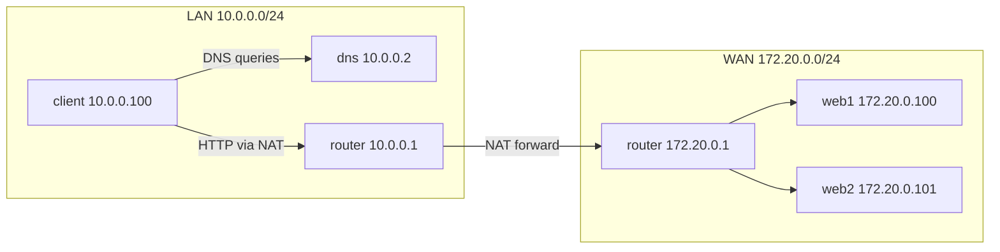

# Topology

The lab simulates a small Internet-like environment with two networks:

- **LAN**: `10.0.0.0/24` (client, DNS, router LAN IP)
- **WAN**: `172.20.0.0/24` (two web servers, router WAN IP)

**Key points**
- The router performs **source NAT (masquerade)** for LAN → WAN traffic.
- DNS provides **round-robin A records** so `web.lab.test` alternates between `web1` and `web2`.
- You will capture **TCP handshakes** on the router WAN interface and analyze them with Wireshark.
